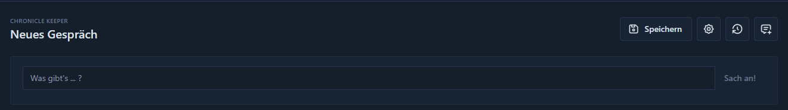

# Gespräche

?> **Ab v0.4-alpha** wird der Gesprächsbereich vollständig überarbeitet sein. Die folgende Anleitung bezieht sich
vollständig auf diese bereits neue Version. In vorherigen Versionen war nur ein einzelnes aktives Gespräch möglich.

Der Bereich "Gespräche" im Chronicle Keeper ermöglicht es dir, interaktive Unterhaltungen mit dem Chronicle Keeper zu
führen und so im Prinzip eine "Suchmaschine" für alle Dokumente und Bilder in deiner Bibliothek zu nutzen. Nur als großes
Plus wird diese Suchmaschine Informationen interpretieren und in gewünschtem Maße auch weiterspinnen. Warum nicht ganze
Charaktere auf Basis deiner Welt generieren? Völlig neue NPCs mit Charakterbögen und allem, was wichtig ist, um diese
in deine Spielwelt einzubinden?

Das Verfolgen von Geschehnissen in deiner Welt fällt dir schwer? Wie könnte sich eine Situation weiterentwickeln? Die NPCs, mit
denen sich die Heldengruppe gerade noch auseinandergesetzt hat, sind weg, aber wie könnte ihr Leben weiter verlaufen sein?
Könnten sie nicht noch einmal auf die Heldengruppe treffen? Das alles kannst du in Gesprächen herausfinden, wenn du genug
Daten zur Verfügung stellst. Lass dich aus deinen Gesprächen inspirieren oder dein persönliches Wissen noch einmal auffrischen,
ohne alles im Kopf behalten zu müssen.

## Gesprächsführung

Wenn du auf den Namen deines Chronicle Keepers im Menü klickst, dann erreichst du den Bereich der Gespräche. Du wirst
eine Textbox vorfinden und einige Buttons, die dir weitere Möglichkeiten bieten. Um ein Gespräch zu starten, kannst du
einfach eine beliebige Nachricht an deinen Chronicle Keeper in die Textzeile eingeben und diese abschicken mit einem
Druck auf Enter oder einem Klick auf "Senden".

Dein Chronicle Keeper wird sich dann auf den Weg machen und einige Regale in deiner Bibliothek durchsuchen, etwas Staub
von ihnen abwischen, um den Räumlichkeiten zur Genüge zu kommen, und dann wird er dir eine Antwort auf deine Nachricht
geben. Je nach Umfang deiner Anfrage kann es durchaus einen Moment dauern, bis du eine Antwort bekommst.

In der Aktionszeile über dem Formular findest du folgende Aktionen von links nach rechts:

- Speichern des Gesprächs oder Bearbeiten des geladenen Gesprächs
- Einstellungen für das Gespräch
- Verlaufsanzeige der letzten 10 gespeicherten Gespräche
- Beginn eines neuen Gesprächs

Bitte beachte in den Gesprächen, dass nur das aktuell geladene Gespräch als Kontext genutzt wird. Alle Fragen und Antworten
sind auswertbare Informationen, jedoch keine Informationen aus vorherigen Gesprächen. Dein Chronicle Keeper wird sich nur
auf dieses fokussieren. Du bist dazu herzlich eingeladen, bei unklaren Aussagen noch einmal nachzuhaken oder korrigierend
einzugreifen und deinem Keeper die Möglichkeit zu geben, noch einmal in sich zu gehen.

?> **Tipp** Frag doch einmal nach einem Charakterbogen für einen NPC aus deinen Dokumenten?

Ansonsten: Viel Spaß.

## Aufbau einer Antwort

Jede Antwort deines Chronicle Keepers wird vollständig ausgegeben. Es kann sein, dass neben dem Text auch hinterlegte
Bilder in die Antwort eingebettet werden. So viel, so erwartbar.

Neben jeder Antwort, am rechten Rand, findest du ein kleines Dokumenten-Icon mit einem Plus darauf. Dieses kannst du
verwenden, um den Text, der dir als Antwort gegeben wurde, in ein neues Dokument zu übernehmen, ohne selbst einen Copy-
and-Paste-Prozess zu starten. Du landest direkt mit dem ausgegebenen Text auf der Seite für die Erstellung eines
Dokuments. Das kann durchaus nützlich sein, wenn du mit deinem Chronicle Keeper etwas erarbeitet hast und dieses
gerne in deiner Bibliothek hinterlegt wissen möchtest, um zukünftig auf diesen Inhalt auch zugreifen zu können in Suchen.

### Nachverfolgbarkeit

Wenn du in den [Tuning-Einstellungen](settings) die Ausgabe für Funktionsdetails aktiviert hast und bei deiner Anfrage auf
Hintergrundinformationen zugegriffen wurde, wirst du direkt unter der Antwort des Chronicle Keepers einen Bereich mit
dem Titel "GPT Functions Debugging Ausgaben" finden. Dort wird dir eine Liste der einzeln aufgerufenen Funktionen gegeben.
Jede Funktion kann auch mehrfach auftauchen, je nachdem, wie deine Frage gestaltet war. Es können aber auch viele
Funktionen sein.

Zu jeder Funktion, die aufgerufen wurde, werden dir bei einem Klick auf den Namen der Funktion weitere Informationen
zu diesem Funktionsaufruf gegeben. Gerade für die Suche nach Dokumenten und Bildern können wertvolle Informationen
gegeben werden, um das Tuning für eine Verbesserung der Antworten zu betreiben. Das kann auch im selben Gespräch
passieren. Du kannst so einfach etwas mit den Distanzen in der Suche herumspielen. Wenn du mehr zu den Distanzen erfahren
willst, kannst du in den [Tuning-Einstellungen](settings) nachlesen, was die einzelnen Werte überhaupt bedeuten.

Etwas weniger technisch wird es, wenn du nur die Funktionen für die Anzeige von Kontextdokumenten und -bildern in den
[Allgemeinen Einstellungen](settings) aktivierst. Du bekommst dann unter Antworten, die dazu geführt haben, dass
Kontextinformationen geladen wurden, einen Bereich mit dem Titel "GPT Functions Used Information". In diesem werden
die Dokumente und Bilder aus deiner Bibliothek einfach nur aufgelistet. Sie sind hier verlinkt, so dass du durch einen
Klick darauf auch zu ihnen kommst.

## Speichern oder Bearbeiten

Wenn du auf den Button mit dem Titel "Speichern" klickst, kannst du ein temporäres Gespräch, also eines, das noch nicht
gespeichert wurde, in deine Bibliothek überführen. Es wird dabei aus der Bibliothek nicht für andere Gespräche zu Rate
gezogen, sondern dient nur deiner eigenen Sortierung, falls du Gespräche später fortsetzen möchtest. Zum Beispiel könntest
du ein Gespräch über einen speziellen NPC aus deiner Bibliothek abspeichern und später fortführen. Das Gespräch, damit
du es wiederfindest, könntest du so direkt auch in einem eigenen Verzeichnis mit allen anderen Informationen zu diesem
NPC abspeichern.

Ein Gespräch muss nun in diesem Dialog einen Titel bekommen und du wählst das Verzeichnis aus. Lädst du ein vorhandenes,
abgespeichertes Gespräch, dann wird dieser Button dir die Gelegenheit geben, das Gespräch umzubenennen oder in ein anderes
Verzeichnis zu verschieben.

?> **Tipp** Du brauchst während eines Gesprächs nicht auf den Button klicken. Neue Fragen und Antworten werden automatisch
in den Speicherstand übernommen und stehen dir beim nächsten Aufruf des Gesprächs wieder zur Verfügung.

## Einstellungen

Beim Klick auf das Zahnrad in der Aktionsleiste wirst du eine Auswahl an Einstellungen erhalten. Diese sind
ausschließlich für dieses Gespräch und werden mit dem Gespräch auch immer wieder geladen. Es ist so möglich, in
diversen Gesprächen auch diverse Einstellungen zu haben.

In einem Gespräch über Fakten willst du vielleicht niedrigere Werte verwenden als bei kreativen Gesprächen. Wichtig
ist auch, dass du hier die GPT-Version auswählen kannst. Die verschiedenen Modelle haben dabei unterschiedlich
umfangreiche Fähigkeiten. In der Regel wird der Standardeintrag absolut ausreichen für alle Gespräche, aber wenn es
etwas komplexer wird, könnte es sinnvoll sein, die anderen Modelle von GPT einmal auszuprobieren.

!> **Vorsicht** Die unterschiedlichen GPT-Modelle verursachen unterschiedliche Kosten in der Verwendung. Mehr
Informationen dazu findest du auf der [Preisgestaltung von OpenAI](https://openai.com/api/pricing/).

## Verlauf

Hinter dem Verlauf findet sich ein einfacher Dialog, der dir die letzten 10 Gespräche anzeigt. Es erlaubt dir so einen
Schnellzugriff zwischen den verschiedenen Gesprächen zu wechseln, ohne sie in der Bibliothek suchen zu müssen. Angezeigt
wird dir der Titel und ein Link zum Gespräch.

## Neues Gespräch

Das letzte Icon mit dem Nachrichtensymbol und dem Pluszeichen darauf wird dir erlauben, ein neues Gespräch anzufangen.
Wichtig ist, dass dies nur ein temporäres Gespräch ist, bis du es aktiv abspeicherst. Ein weiterer Klick auf das Icon würde
das aktuell offene temporäre Gespräch auch löschen. Es ist also nur ein temporäres Gespräch zur selben Zeit möglich.
