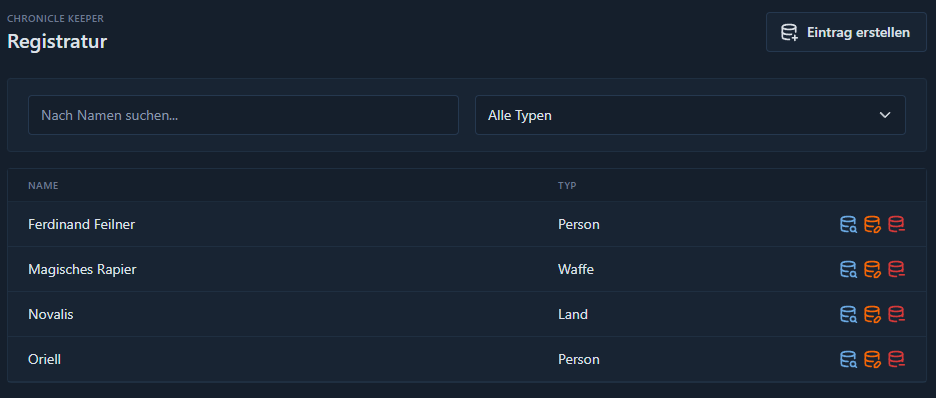

# Registratur

?> Neu im Menü ab **v0.7-alpha**

Die Registratur ist dein zentrales Nachschlagewerk im Chronicle Keeper. Sie ist eine bewährte Technik, um Schlagworte aus allerlei
Kategorien in deiner Rollenspielwelt zu hinterlegen. Nützlich wird es deshalb, weil du zwischen den einzelnen Einträgen auch
Verbindungen herstellen kannst, die spezielle Typen aufweisen. Es sind auch mehrere Verlinkungen zwischen den einzelnen Einträgen
möglich, sodass du ihnen eine möglichst detaillierte Struktur geben kannst.

Du versuchst herauszufinden, zu welcher Person eine einzelne Person Verbindungen hat und hast Kenntnisse darüber, welche eventuell
nützlichen Gegenstände dieser Charakter hat? Dann trage es dir in deine Registratur ein und du musst es dir nicht merken oder
in einzelnen Dokumenten zur Verfolgung niederschreiben. Du kannst auch aus deiner Rollenspielrunde vorhandene Quests verfolgen.
Ihr habt einen kleinen Auftrag angenommen, den ihr vielleicht in ein paar Monaten auf eurer Reise erledigen wollt? Aber du willst
dir das nicht merken? Notiere es dir hier zusammen mit einem Zielort und beteiligten Personen und du hast immer wieder Einsicht.

Die Registratur gibt deinem Chronicle Keeper so die Möglichkeit, auch detailliertere Informationen zu den Strukturen deiner Welt zu
erhalten. Ob du als Spielleiter einfach alles Relevante für deine Welt hinterlegst oder als Spieler das Wissen deines Charakters
verfolgen möchtest und sehen möchtest, wie dieses immer mehr wird, alles ist möglich.

?> **Tipp!** Je mehr du die Registratur nutzt und pflegst, desto wertvoller wird sie für deine Arbeit mit dem Chronicle Keeper.

## Übersicht

In der Registratur kannst du eine Übersicht aller deiner Einträge erhalten. Ab einer gewissen Zahl wirst du dich auch durch mehrere
Seiten wühlen müssen. Daher stehen dir für die einfache Suche auch folgende Möglichkeiten zur Verfügung:

- Eine Suche nach dem Namen. Es wird eine einfache Suche ausgeführt, wenn du etwas eingibst.
- Eine Suche nach dem Typ des Eintrages. Suchst du nach Waffen? Dann wähle das hier aus.

Beide Suchen sind mit einer UND-Verknüpfung gemacht. Gibst du einen Namen ein und wählst einen Typen aus, dann werden dir alle
Einträge mit passendem Namen und passendem Typen ausgewählt.

Für die einzelnen Einträge in deiner Registratur stehen dir einige Funktionen zur Verfügung.

- Das Wechseln in die Detailansicht eines Eintrages.
- Das Bearbeiten eines Eintrages.
- Das Löschen eines Eintrages.

## Einträge verwalten

### Neuen Eintrag erstellen

1. Klicke auf den Button "Eintrag erstellen" über der Liste deiner Einträge.
2. Gib einen Titel für den Eintrag ein.
3. Wähle einen Typen für deinen Eintrag aus. Beachte aber bitte, dass dieser nicht zu ändern ist.
4. Gib eine knackige Beschreibung ein. Sie muss nicht so ausführlich sein, da du später auch Einträge aus deiner Bibliothek verlinken kannst.

?> **Tipp!** Verwende aussagekräftige Titel, um später schnell die richtigen Einträge zu finden.

### Einträge bearbeiten

Beim Bearbeiten eines Eintrages kannst du sowohl die Beschreibung als auch den Namen ändern. Was du aber nicht ändern kannst, ist der
Typ, da dieser mit den vorhandenen Verbindungen stark verknüpft ist. Nicht jede Art der Verknüpfung steht für jeden Typen zur Verfügung,
da es keinen Sinn ergibt, wenn eine Waffe, die eine Person geschmiedet hat, plötzlich ein Land wird.

Beachte dies bitte, wenn du einen Eintrag anlegst.

## Verknüpfungen

Um Verknüpfungen herzustellen, musst du in die Detailansicht eines Eintrages wechseln. Dort stehen dir dann folgende Varianten zur Verfügung.

1. **Medienverknüpfung**

Sie stellen eine Verbindung zu Dokumenten, Bildern und Gesprächen in deiner [Bibliothek](library.md) dar und geben dir die Möglichkeit,
in dieser auch ausführlichere Informationen zu hinterlegen.

2. **Beziehungen**

Beziehungen stellen einen starken Weg dar, um deinem Chronicle Keeper detaillierter zu erklären, wie deine Welt funktioniert, ohne dass er jedes
deiner Dokumente vollständig kennen muss. Du kannst hier strukturiert hinterlegen, in welcher Beziehung einzelne Einträge zueinander stehen.
Es steht dir eine umfangreiche Möglichkeit zur Verfügung, um dies zu tun. Aus allen möglichen Bereichen des Lebens wurde versucht abzubilden,
wie Dinge in einer Welt miteinander verknüpft sein können.

?> **Tipp!** Wenn hier Möglichkeiten fehlen, dann wende dich gerne an die Entwickler des Chronicle Keeper und sie werden neue Typen und
Beziehungen möglich machen können. Mache dazu ein Ticket auf [Github](https://github.com/ChronicleKeeper/ChronicleKeeper/issues) auf.

Da die Beziehungen bi-direktional sind, musst du sie nur einmalig anlegen und hast auf beiden Seiten der Beziehung eine passende Beschreibung
dieser Beziehung. Du kannst einfach zwischen ihnen herklicken.

## Gespräche

Der Chronicle Keeper weiß, dass du in deiner Registratur auch weitergehende Informationen zur Verfügung stellst, die ihm helfen, deine Fragen
besser zu beantworten. Entsprechend wird er, wenn du mit ihm ein Gespräch führst, auch in deiner Registratur nach weitergehenden Informationen
suchen. Dies tut er, indem er aus deiner Frage Stichworte nimmt, die sich eventuell in deiner Registratur finden könnten. Jedes dieser
Stichworte schlägt er dann nach und wird die gefundenen Informationen und Beziehungen nutzen, wenn es einen Mehrwert ergibt.

Natürlich kannst du in deinen [Einstellungen](settings) auch anpassen, wie ausführlich er diese Informationen nutzen soll, indem du es in einem
Prompt für die Gespräche ausführst. Im Normalfall, wenn du hier keine Anpassung vornimmst, wird er dabei relativ defensiv vorgehen.

## Import und Export

Deine Registratureinträge werden automatisch in den [Sicherungen](backup.md) berücksichtigt und so auch nach Updates in die nächste Version
des Chronicle Keeper übertragen.
