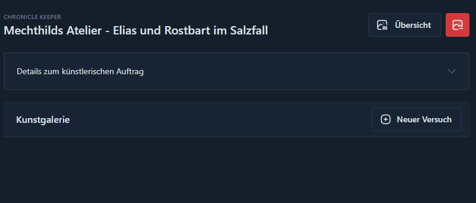
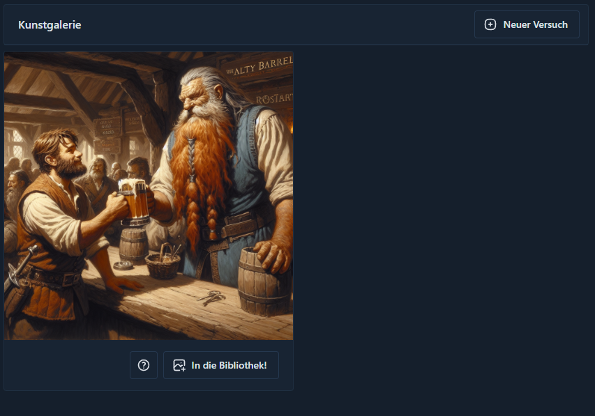

# Künste der Mechthild

?> Neu im Menü ab **v0.5-alpha**

> **Inspiration** - Mechthild von Magdeburg (1207–1282), eine deutsche Mystikerin und Autorin, die in ihrer religiösen
> Ekstase und Poesie lebhafte Bilder von Licht und Feuer beschrieb. Diese Bilder könnten leicht in mittelalterliche
> Kunst umgesetzt worden sein.

In Mechthilds Atelier ist es möglich, mithilfe der Daten in der Bibliothek Bilder zu generieren. Es ist dabei nicht
nötig, jedes Bild im ersten Schritt bis ins kleinste Detail zu beschreiben, da aus der Eingabe im ersten Schritt
Informationen wie Namen, Orte und Ereignisse gezogen werden, um weitere Kontextdaten aus deiner Bibliothek zu suchen.

Diese Daten werden dann für eine ausführliche Beschreibung deines Wunsches nach einem Bild verwendet. Du hast aber die
Möglichkeit, die generierte Eingabe jederzeit anzupassen, um neue Versuche auszuführen. Eine erneute Referenzierung der
Bibliothek ist dabei dann aber nicht möglich. Dafür müsstest du eine neue Anfrage stellen.

Als Grundlage für die generierten Bilder wird die von OpenAI zur Verfügung gestellte technische Plattform mit dem Namen
Dall-E 3 verwendet. Diese erlaubt keine umfangreiche Bildbearbeitung, weshalb es aktuell nur möglich ist, immer neue
Bilder zu generieren.

## Schritt für Schritt vom Pinsel auf die Leinwand

Schauen wir uns den Prozess etwas mehr im Detail an.

### Anlegen eines neuen Arbeitsauftrags

Um eine neue feine Arbeit in Auftrag zu geben, braucht es einen Titel, damit du deinen Auftrag auf der Übersichtsseite
auch wiederfindest. Ansonsten erfüllt der Titel keinen Zweck. In der Beschreibung für den Auftrag kannst du
hineinschreiben, was du möchtest. Das kann eine sehr detaillierte Beschreibung sein, aber auch einfach nur Stichworte.
Zu empfehlen ist es, dass du einfach nur grob erklärst, was du möchtest, da der Text im weiteren Prozess
umgeschrieben wird mit den Informationen aus deiner Bibliothek.

Du kannst hier zum Beispiel eingeben, dass du ein Bild von einem Charakter aus deiner Datenbank an einem bestimmten
Ort haben möchtest, der in deiner Datenbank ebenso beschrieben ist. Du brauchst diese Dinge nicht im Detail beschreiben,
da im weiteren Verlauf diese Informationen, soweit verfügbar, genutzt werden, um deine Eingabe umzuschreiben.

### Optimierung des angelegten Arbeitsungsauftrages

Du hast nun einen angelegten Auftrag, der noch keine Bilder enthält. Wenn du den generierten Arbeitsauftrag überprüfen
oder ändern möchtest, kannst du einen Editor mit dem kleinen Pfeil rechts von "Details zum künstlerischen Auftrag"
öffnen. Du kannst hier jederzeit auch den Text anpassen, wenn dir das Ergebnis auf der Leinwand nicht gefällt.

Bitte achte darauf, dass sich in dieser Textbox nur Informationen zum Aussehen des Bildes befinden. Informationen zu
Gefühlen oder Situationen, die man nicht auf einem Bild festhalten kann, können sich darin äußern, dass im Bild dann ein
Text generiert wird. Das ist aber nicht immer der Fall.

### Mechthild an die Leinwand bitten

Auf deiner Auftragsseite findest du den Button **Neuer Versuch** neben der Überschrift "Kunstgalerie". Hier kannst du
so viele Bilder generieren, wie du möchtest. Jeder Klick löst einen neuen Versuch aus. Bitte sei darauf vorbereitet,
dass es einige Zeit in Anspruch nehmen kann, bis Mechthild ein Bild gemalt hat.

Das Ergebnis wird unterhalb der Galerie angezeigt und jeder neue Versuch reiht sich vor diesem Bild ein. Für jeden
Versuch eines Auftrags wird dann auch der aktuell gültige Text genutzt, der sich in der Beschreibung des Auftrags
befindet. Du siehst unterhalb des Bildes zwei Buttons.

Der Hilfe-Button ermöglicht es dir, auf den Text zuzugreifen, den Mechthild verstanden hat. Sie wird deinen Arbeitsauftrag
selten 1:1 nutzen, da sie sich auch selbst ein paar Gedanken für dein Bild macht. Sie wird vor allem Informationen
herausnehmen. Dieser Text ist in englischer Sprache und dient dir mehr als Hilfe, um eventuell Optimierungen für einen
weiteren Versuch zu finden. Sie ist eine sture Frau und wird deshalb auch wirklich nie zu 100% auf dich hören.

Der zweite Button mit der Aufschrift "In die Bibliothek" ermöglicht es dir, ein Bild in deine Bibliothek zu übertragen,
wenn du mit diesem wirklich zufrieden bist. Das ist auch nur einmal je Bild möglich. Bei der Übertragung wird dann, als
würdest du ein Bild direkt hochladen, dieses noch einmal analysiert, um eine möglichst gute Beschreibung für das Bild
in der Bibliothek zu hinterlegen.

## Erwartungshaltungen

Technisch gesehen ist es nicht möglich, dass Mechthild dir ein Bild malt, das du dir in deinem Kopf vorstellst. Sie
wird immer nur das malen, was sie in deiner Beschreibung verstanden hat. Es ist also wichtig, dass du so genau wie
möglich beschreibst, was du dir vorstellst. Es ist auch nicht möglich, dass sie dir ein Bild malt, das weit weg von
deiner eigenen Vorstellung ist. Entsprechend solltest du nachsichtig mit ihr sein und im Zweifel mehrere Versuche wagen
und dich auch selbst ausprobieren bezüglich deiner Beschreibungen.

Sie hat leider auch das Problem, dass sie manchmal nicht weiß, was ein Rollenspiel ist und dass es hier mehr Rassen als nur
Menschen gibt. Es kann also, neben der Beschreibung der Personen in unserem Kopf, hilfreich sein, auch weiter auszuführen,
was man meint. Es ist keine Schande, wenn man Mechthild noch erklären würde, was mit, zum Beispiel, einem "Zwerg" gemeint
ist, denn auch wenn sich in der Beschreibung hinter dem Hilfebutton das Wort "Dwarf" findet, kann es sein, dass man einen
Riesen auf das Bild gemalt bekommt.

Bitte habe also immer im Hinterkopf, dass Mechthild eine einfache Künstlerin ist, die weniger in der Welt herumgekommen
ist als du.

## Export & Import

Es können teilweise sehr viele Leinwände herumliegen, die es nie in deine Bibliothek geschafft haben. Grundlegend kann
man davon ausgehen, dass du sicherlich auch aufräumst, aber da jedes Bild auch eine sehr große Datei ist, wird zur
Optimierung deiner Exporte darauf verzichtet, deine Aufträge an Mechthild und ihre Versuche zu exportieren. Entsprechend
wirst du nach einem Update oder nach dem Einspielen einer Sicherung deine Aufträge auch nicht mehr wiederfinden.

Wenn du einen Auftrag ausführst und vorhast, ein Bild zu behalten, dann übertrage dieses bitte auch in deine Bibliothek.
