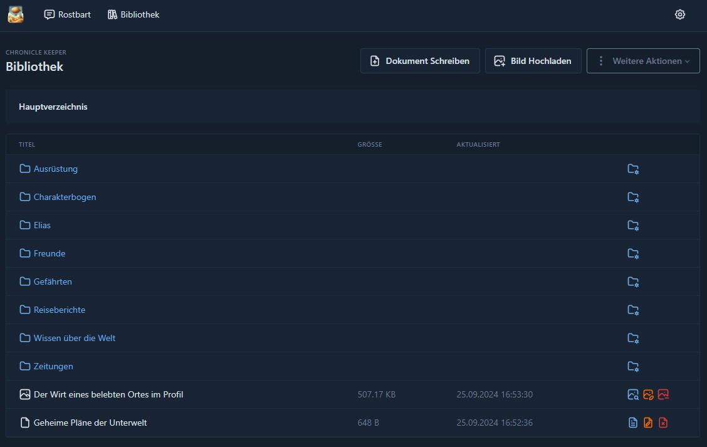
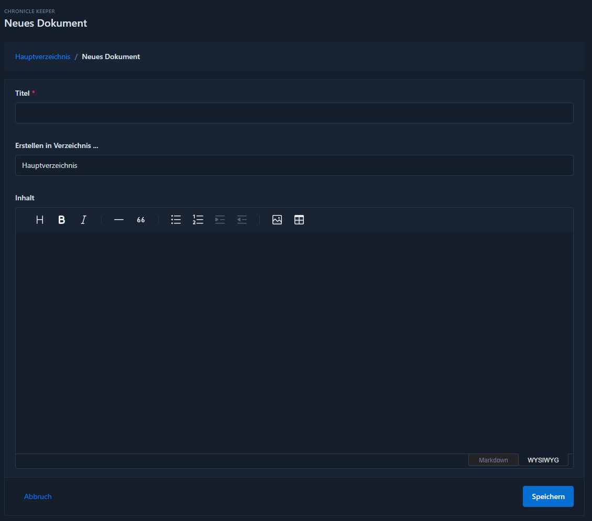

# Bibliothek

In der Bibliothek des Chronicle Keeper befinden sich alle deine Daten, die du dem Keeper zur Verfügung stellen willst,
um dir zu helfen, dich gut in deiner Welt zurechtzufinden. Es ist das gesamte Wissen, das du zu deiner Spielwelt hast.
Sowohl Texte als auch Bilder sind Bestandteil deines umfangreichen Wissens.

Der [Chatbot](chatbot) gibt dir die Gelegenheit, mit diesen Daten zu interagieren.

?> **Tipp!** Je mehr Daten sich in deiner Bibliothek befinden, desto mehr kann dir dein Keeper dabei helfen. Er wird
nicht versuchen, sich etwas auszudenken, wenn du das nicht willst. Er wird sich an die Fakten halten und sie vielleicht,
hier und da, nach deinen Wünschen etwas freier interpretieren.

## Übersicht

Auf der Übersichtsseite findest du deine ganzen Dokumente und Bilder, die du dem Keeper zur Verfügung gestellt hast. Du
hast die Möglichkeit, eine Ordnerstruktur anzulegen, sodass du auch in der Bibliothek des Keepers eine gewisse Ordnung
bewahren kannst.

Über der Tabelle findest du rechts allgemeine Funktionen, die du in der Bibliothek ausführen kannst. Diese sind:

- Ein Dokument schreiben
- Ein Bild hochladen
- Ein Dokument hochladen
- Ein neues Verzeichnis anlegen
- Die Chatdaten aktualisieren

Die einzelnen Aktionen werden in dieser Dokumentation noch weitergehend erklärt. Die Übersicht ist in jedem Verzeichnis
identisch aufgebaut. Es ändert sich nur der Pfad über der Liste, da dieser den gesamten Pfad zum aktuell offenen
Verzeichnis anzeigt.

## Ein Dokument schreiben

?> **Tipp!** Je spezifischer deine Dokumente im Inhalt sind, desto besser sind die Gespräche mit dem Chronicle Keeper
am Ende, da er weniger Informationen auswerten muss, um dir deine Frage so gut es geht zu beantworten.

Alle Dokumente werden im Format [Markdown](https://de.wikipedia.org/wiki/Markdown) hinterlegt. Im Gegensatz zu einfachen
Textdateien erlaubt dies dem Keeper, deine Dokumente etwas weitergehend zu interpretieren. Damit du das Format aber nicht
lernen musst, gibt es eine Textbox mit einer Auswahl an Formatierungsoptionen, die dir auch direkt eine Vorschau anzeigen.

Dem Dokument musst du dabei einen aussagekräftigen Titel geben. Dieser Titel ist auch relevant, da er dem Keeper einen
ersten Indikator gibt, um welche Inhalte es in dem Dokument geht. Dieser Titel ist an sich von der Länge her aktuell nicht beschränkt, aber da er nicht Teil der Suche an sich ist, solltest du hier natürlich keinen Roman hinterlegen.

Zusätzlich kannst du, wenn dir auffällt, dass du im falschen Verzeichnis ein Dokument anlegen willst, noch das Verzeichnis
ändern, ohne das Dokument von neuem erstellen zu müssen. Entsprechend findest du diese Möglichkeit auch in der Bearbeitung
eines Dokumentes. Im Standard ausgewählt ist das Verzeichnis, in dem du dich gerade befunden hast, als du entschieden
hast, eine neue Geschichte zu schreiben.

In der Texteingabe, wie eingangs erwähnt, hast du die Möglichkeit, einen umfangreich formulierten Text einzugeben. Auch
das Einbetten von Tabellen und verlinkten Bildern ist kein Problem. Du kannst deiner Kreativität hier freien Lauf lassen.
Beachte aber bitte, dass der Text gewissen Längenbeschränkungen unterliegt, da ChatGPT hier Begrenzungen aufzeigt.
Solltest du also vorhaben, mehr Text zu hinterlegen, kann nur die Empfehlung ausgesprochen werden, die Texte eventuell
aufzusplitten.

Hast du zum Beispiel vor, ein Tagebuch für deinen eigenen Charakter zu schreiben, würde es sich anbieten, einzelne Tage
in einzelne Dokumente aufzusplitten. Willst du das Wissen zu einer Region notieren und das ist sehr umfangreich, würde
es sich anbieten, dieses aufzuspalten in allgemeine Informationen, Persönlichkeiten, politische Situation, Händler und
Knilche, etc.

## Ein Bild hochladen

Du kannst zu Charakteren, Orten oder was auch immer du dir vorstellen kannst in deiner Spielwelt Bilder hochladen.
In diesem Prozess wird versucht, den Inhalt des Bildes umfangreich durch ChatGPT zu beschreiben. Als Basisinformation
wird auch der Name des Bildes verwendet, sodass die Benennung des Bildes in etwas, das es deiner Meinung nach
darstellt, vor dem Hochladen keine schlechte Idee ist.

Auf Grundlage des Namens des Bildes sucht ChatGPT auch nach bereits bekannten Informationen in deiner Bibliothek, die
dabei helfen könnten, das Bild richtig einzuordnen.

Nach diesem Prozess wirst du auf die Seite des neuen Bildes geleitet und du kannst die Beschreibung so anpassen, wie es
dir beliebt. Die Beschreibung ist am Ende als Hilfestellung in Gesprächen nötig, um auf deine Frage mit mehr
Informationen antworten zu können und eventuell die Informationen, die du suchst, auch mit diesem anzureichern.

## Ein Dokument hochladen

?> Neu ab **v0.4-alpha** - Das Hochladen von PDF Dateien wird nun unterstützt

Es ist aktuell möglich, Dokumente mit den folgenden Formaten direkt in das System zu laden:

- Einfache Textdateien
- PDF
- Markdown
- Microsoft Word

Gerade bei Dateien aus Word-Programmen ist die Umwandlung in das Markdown-Format nicht immer gut möglich, da es zu
viele Möglichkeiten der Formatierung gibt und gerade MS Word nicht dafür bekannt ist, die Rohdaten in sauberem Zustand
zu hinterlegen. Auch bei PDFs gibt es das Problem, dass jedes Programm zum Schreiben dieser den Standard etwas anders
auslegt und entsprechend die Auswertung nicht so einfach ist. Es gibt sogar PDF Dateien mit Text, die gar keinen Text
beinhalten, sondern dieser als Bild hinterlegt ist. Entsprechend ist es kompliziert ein PDF mit allen Ecken und Kanten
korrekt in Text umzuwandeln.

Um diesem Umstand gerecht zu werden und keinen wirren Texthaufen zu importieren, gibt es ergänzend die Funktion, den
eingelesenen Text durch ChatGPT korrigieren und sachgerecht formatieren zu lassen. Inhaltlich wird sich dabei nicht
viel verändern. Sollte dir die Formatierung des eingelesenen Textes also nicht gefallen, kannst du mit dieser Funktion
aktiviert das Dokument noch einmal hochladen.

Ansonsten ist das Ergebnis vergleichbar, als würdest du selber den Text schreiben oder per Copy & Paste einfügen.

## Verzeichnis anlegen & bearbeiten

?> Neu ab **v0.4-alpha** - Das Verschieben von Verzeichnissen ist möglich.

Für die Pflege deiner Strukturen in der Bibliothek kannst du neue Verzeichnisse anlegen, so viele es benötigt, dass du
dich in deiner Bibliothek zurechtfindest. Jedes Verzeichnis muss dabei einen Titel haben, der für dich sprechend anhand
der Verzeichnisstruktur ist. Es ist möglich, mehrere Verzeichnisse mit dem gleichen Namen zu haben. Hier gibt es
keinerlei Restriktionen.

Nach dem Anlegen eines Verzeichnisses ist es weiterhin möglich, es in der Struktur zu verschieben, indem man es
bearbeitet. Man hat hier dann den vollständigen Verzeichnisbaum zur Verfügung, um das Verzeichnis in ein anderes
Verzeichnis zu verschieben. Es ist dabei aber nicht möglich, das Verzeichnis in seine eigenen Unterverzeichnisse
zu verschieben.

Die Struktur hat für Gespräche mit dem Chronicle Keeper weiter keine Bewandtnis und ist so nur für dich.

## Verzeichnis löschen

?> Neu ab **v0.4-alpha** - Das Löschen von Verzeichnissen ist möglich.

Beim Löschen von Verzeichnissen ist eine entscheidende Wahl zu treffen. Will man seine Inhalte in diesem Verzeichnis
behalten und verschieben oder alle Daten löschen? Entsprechend findet sich auf der Seite, die sich beim Löschen öffnet,
eine Checkbox, die man aktivieren muss, um das Löschen aller Inhalte dieses Verzeichnisses zu bestätigen. Wird diese
Checkbox nicht angewählt, dann werden die Inhalte automatisch verschoben, sobald man das Formular anklickt.

Bitte stelle sicher, dass du nicht aus Versehen ein Verzeichnis löschst, das noch wertvolle Inhalte hat. Die Daten sind
dann unwiderruflich gelöscht, wenn du nicht eine [Sicherung](backup) hast, die du wieder einspielen kannst.

## Chat Refresh

Damit Änderungen in der Bibliothek für Gespräche mit dem Chronicle Keeper aktiv werden, muss der Chat einmal mit allen
gemachten Änderungen aktualisiert werden. Dies kann einen Moment dauern, da hier alle veränderten oder neuen Dokumente
und Bilder in ein für den Chat lesbares Format umgewandelt werden. Das ist wichtig, da es sonst sein kann, dass dir
nicht alle Informationen zur Verfügung gestellt werden können.

## Gespräche

?> Neu ab **v0.4-alpha**

Zwischen all deinen Dateien, die deine Gespräche mit dem Chronicle Keeper unterstützen, findest du auch deine
gespeicherten Gespräche mit dem Chronicle Keeper. Du kannst sie so jederzeit wieder aufrufen und fortführen. Mehr über
Gespräche findest du in der [Dokumentation der Gespräche](chatbot).
