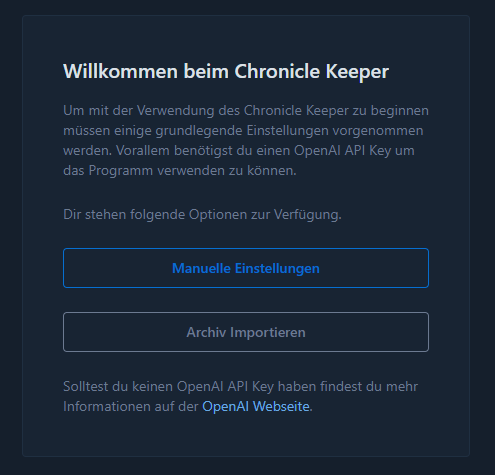

# Installation

?> **Vor der Installation** Der Chronicle Keeper befindet sich in der Entwicklung. Bitte kontaktiere den Entwickler,
um den Chronicle Keeper im engen Austausch weiterzuentwickeln.

## Kontakt

Du kannst eine E-Mail an [denis.zunke@gmail.com](mailto:denis.zunke@gmail.com) schreiben.
Weitere Kontaktmöglichkeiten:

- [Twitter / X](https://x.com/DZunke)
- [GitHub Issues](https://github.com/ChronicleKeeper/ChronicleKeeper/issues)

## Voraussetzungen

Der Chronicle Keeper benötigt ein Windows-Betriebssystem. Andere Betriebssysteme werden für die Desktop-Variante
derzeit nicht unterstützt. Zusätzlich wird ein [API Key von OpenAI](https://platform.openai.com/api-keys) benötigt.

Bitte beachte, dass der API Key nicht im "Free Tier" sein sollte, da die Limitierungen für eine reale Anwendung
ungeeignet sind. Mindestens das Tier 1 sollte vorliegen, was durch eine Einzahlung von mindestens 5$ auf das
OpenAI-Konto erreicht wird.

Falls nach 48 Stunden weiterhin nur das "Free Tier" aktiv ist, wende dich an den OpenAI Support.

?> Eine Übersicht über die Zugriffstufen von OpenAI findest du
[hier](https://platform.openai.com/docs/guides/rate-limits/usage-tiers?context=tier-one).

## Download & Setup

Die aktuellste Version des Chronicle Keepers kannst du auf GitHub herunterladen. In den Releases findest du zu jeder
Version ein entsprechendes ZIP-Archiv, das die vollständige Anwendung beinhaltet.

Die aktuellste Version kannst du hier herunterladen:
[Chronicle Keeper Releases](https://github.com/ChronicleKeeper/ChronicleKeeper/releases/latest)

Nachdem du das ZIP-Archiv heruntergeladen und entpackt hast, kannst du im entpackten Verzeichnis
die Datei `ChronicleKeeper.exe` ausführen. Es öffnet sich dann ein Fenster, das im ersten Moment ein wenig länger
brauchen könnte, bis es geladen ist.

Herzlichen Glückwunsch. Der Chronicle Keeper ist bereit für dich. Du kannst dich jetzt entscheiden, ob du einen
Export aus einer vorherigen Version oder eine Sicherung direkt importieren möchtest oder ob du in die Einstellungen
wechselst.

Solltest du keine Sicherung haben, wirst du in die Einstellungen wechseln müssen und dort direkt auf der Seite
landen, wo du deinen OpenAI API Key eintragen kannst. Sobald du diesen hinterlegt hast, werden dir im Menü auch
alle Funktionen freigeschaltet und der Startbildschirm wird nicht mehr weiter angezeigt.

Jetzt kannst du loslegen.

## Upgrade

Hast du bereits eine Version des Chronicle Keepers am Laufen, musst du für das Upgrade auf eine neue Version die im
Download & Setup beschriebenen Schritte für die neue Version ausführen, wählst aber auf der Startseite aus, dass
du ein Archiv importieren willst.

Dazu gehst du wie folgt vor:

1. Exportiere deine Daten aus der alten Version. Die Möglichkeit findest du in den [Einstellungen](settings.md).
2. Das gespeicherte ZIP-Archiv solltest du sicher verwahren, da es auch als Sicherung deiner Daten dient.
3. In deiner neuen Version des Chronicle Keepers wählst du den Import des Archivs aus und wählst das zuvor exportierte
   ZIP-Archiv aus.

Deine Daten sollten nun vollständig in die neue Version geladen sein. Sollte es dabei zu Problemen gekommen sein,
wende dich bitte an die Entwickler. Verloren gegangen ist nichts, da du auch die alte Version noch hast.

?> **Empfehlung** Aufgrund des Entwicklungsstandes des Chronicle Keepers solltest du regelmäßig Exporte ausführen, um
deine Daten vor Verlust zu sichern. Es wäre sehr schade, wenn die wunderbaren Geschichten und Erlebnisse verloren gehen
würden.
